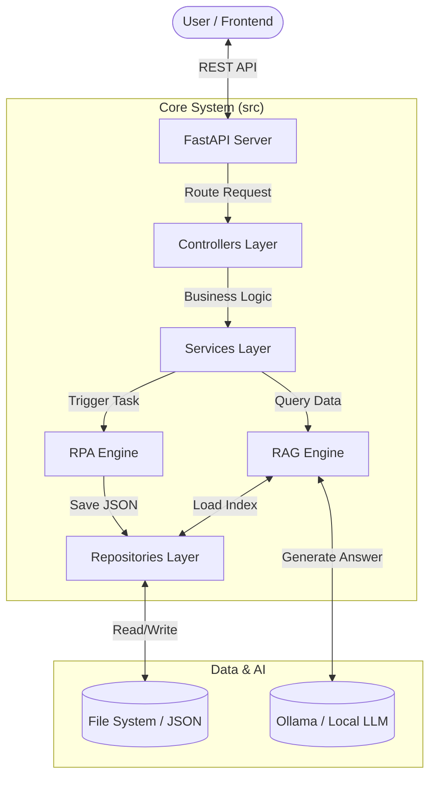

# ⚖️ RPA RD Scraper & ChatBot Platform (API Edition/v2.0)

> [!NOTE]
> **Project Status**: Production Ready (Modular API Architecture)
> ระบบรวบรวมข้อมูลคำวินิจฉัยภาษีอากรและ AI ตอบคำถามภาษีอัจฉริยะ (RAG)

---

## 📖 สารบัญ (Table of Contents)

1. [บทนำและที่มา (Introduction)](#-บทนำและที่มา-introduction)
2. [สถาปัตยกรรมระบบ (System Architecture)](#-สถาปัตยกรรมระบบ-system-architecture)
3. [เจาะลึกการทำงาน (Deep Dive)](#-เจาะลึกการทำงาน-deep-dive)
    - [ส่วนที่ 1: RPA Data Pipeline](#ส่วนที่-1-rpa-data-pipeline-scraper)
    - [ส่วนที่ 2: RAG Intelligence Engine](#ส่วนที่-2-rag-intelligence-engine-ai)
    - [ส่วนที่ 3: Modular API](#ส่วนที่-3-modular-api-structure)
4. [คู่มือการใช้งาน (User Manual)](#-คู่มือการใช้งาน-user-manual)
5. [การแก้ปัญหา (Troubleshooting)](#-การแก้ปัญหา-troubleshooting)

---

## 🌟 บทนำและที่มา (Introduction)

ระบบนี้ถูกพัฒนาขึ้นเพื่อแก้ปัญหา **"การสืบค้นข้อมูลกฎหมายภาษีที่ซับซ้อน"** บนเว็บไซต์กรมสรรพากร โดยระบบจะทำหน้าที่เป็น **ผู้ช่วยอัจฉริยะ** ที่ทำงาน 2 ด้านหลัก:

1. **Automated Data Collection**: ใช้หุ่นยนต์ (RPA) เข้าไปดึงข้อมูลข้อหารือภาษีอากร ย้อนหลัง จากหน้าเว็บไซต์ที่เข้าถึงยาก มาจัดเก็บในรูปแบบ Structured Data (JSON)
2. **Intelligent Q&A**: ใช้เทคโนโลยี **Retrieval-Augmented Generation (RAG)** ร่วมกับ **Large Language Model (Ollama)** เพื่อให้ผู้ใช้สามารถ "ถามคำถามภาษีเป็นภาษาคน" และได้รับคำตอบที่ถูกต้อง พร้อมอ้างอิงเลขที่หนังสือราชการจริง

---

## 🏗️ สถาปัตยกรรมระบบ (System Architecture)

เราออกแบบระบบโดยยึดหลัก **Clean Architecture** และ **Separation of Concerns** เพื่อให้โค้ดดูแลรักษาง่ายและรองรับการขยายตัวในอนาคต



---

## � เจาะลึกการทำงาน (Deep Dive)

### ส่วนที่ 1: RPA Data Pipeline (Scraper)

หัวใจของการหาข้อมูล เราใช้ **Robocorp** และ **Playwright** ในการจำลองพฤติกรรมมนุษย์เข้าไปดึงข้อมูล โดยแบ่งการทำงานเป็นลำดับชั้น (Stages):

- **Stage 1: Year Collector** (`run_year`)
  - เข้าหน้าหลักกวาด "ปี พ.ศ." ทั้งหมดที่มี
- **Stage 2: Month Collector** (`run_month`)
  - เจาะเข้าไปในแต่ละปี เพื่อเก็บลิงก์เดือน
- **Stage 3: URL Collector** (`run_collect_month_urls_task`)
  - กวาดรายการเอกสารทั้งหมดในเดือนนั้น (ได้แค่ชื่อเรื่องและลิงก์)
- **Stage 4: Content Reader** (`run_read_document_content_task`) **(Critical)**
  - **Deep Scrape**: หุ่นยนต์จะกดเข้าไปในทุกลิงก์ เพื่อดึงข้อมูลเชิงลึก ได้แก่:
    - `เลขที่หนังสือ`: สำหรับการอ้างอิงทางกฎหมาย
    - `ข้อหารือ`: คำถามหรือประเด็นปัญหาที่ผู้เสียภาษีถาม
    - `แนววินิจฉัย`: คำตอบชี้ขาดจากกรมสรรพากร
  - *หมายเหตุ*: ข้อมูลส่วนนี้สำคัญที่สุดสำหรับ AI หากขาดส่วนนี้ AI จะตอบคำถามไม่ได้

### ส่วนที่ 2: RAG Intelligence Engine (AI)

สมองของระบบที่ใช้เปลี่ยน "เอกสาร" เป็น "คำตอบ" กระบวนการทำงานภายในคือ:

1. **Preprocessing & Indexing**:
    - เมื่อโหลดเอกสาร ระบบจะสร้าง **Search Index** โดยใช้เทคนิค **TF-IDF (Term Frequency-Inverse Document Frequency)**
    - **Why TF-IDF?**: เราเลือกใช้ `char_wb` (Character N-gram) ซึ่งเหมาะสมกับภาษาไทยที่มีปัญหากรณีสะกดผิดหรือตัดคำไม่สมบูรณ์ และประมวลผลได้เร็วกว่า Vector DB ขนาดใหญ่สำหรับการใช้งานแบบ Local
2. **Semantic Retrieval**:
    - เมื่อมีคำถาม ระบบจะคำนวณ **Cosine Similarity** ระหว่างคำถามและเอกสารทั้งหมด เพื่อหาเอกสารที่ "เนื้อหาใกล้เคียงที่สุด" (Top-K)
3. **Contextual Generation**:
    - นำเนื้อหาจากเอกสารที่หาได้ มาประกอบร่างกับ Prompt Engineering ขั้นสูง:
        > *"คุณคือผู้เชี่ยวชาญภาษี... ตอบคำถามโดยอ้างอิงจากข้อมูลต่อไปนี้เท่านั้น..."*
    - ส่งให้ **Ollama (Model qwen3:8b)** ทำหน้าที่สรุปความเป็นภาษาคนที่อ่านเข้าใจง่าย

### ส่วนที่ 3: Modular API Structure

โครงสร้างโฟลเดอร์ถูกจัดระเบียบใหม่เพื่อความเป็นมืออาชีพ:

- **`src/config/` (Centralized Configuration)**: เปรียบเสมือนกองบัญชาการที่รวบรวมค่าคงที่ (Constants) และการตั้งค่าทั้งหมดของระบบไว้ในที่เดียว (Single Source of Truth) เพื่อให้ง่ายต่อการปรับแต่ง (เช่น เปลี่ยน URL หรือรุ่นโมเดล AI) โดยไม่ต้องแก้ไขโค้ดในส่วนอื่น
- **`src/scrapers/` (Data Acquisition Layer)**: ส่วนงานขุดเจาะข้อมูลที่ใช้เทคโนโลยี **RPA (Playwright)** ทำหน้าที่ปฏิสัมพันธ์กับเว็บไซต์ภายนอก เพื่อแปลงข้อมูลที่ไม่มีโครงสร้าง (Unstructured Data) ให้มาอยู่ในรูปแบบที่ระบบเข้าใจ
- **`src/api/` (Intelligence & Interface Layer)**: หัวใจหลักของระบบที่ทำหน้าที่เป็นทั้ง **RAG Engine** (วิเคราะห์คำถาม, ค้นหาข้อมูล, ประมวลผลผ่าน LLM) และ **API Endpoint** (รับ-ส่งข้อมูลกับผู้ใช้งาน)
- **`src/repository/` (Data Persistence Layer)**: ตัวกลางในการจัดการการเข้าถึงข้อมูล (Data Access) ป้องกันไม่ให้โค้ดส่วนอื่นยุ่งกับไฟล์ JSON หรือฐานข้อมูลโดยตรง ตามหลัก Encapsulation
- **`src/utils/` (Supportive Utilities)**: คลังเครื่องมือเสริมที่ช่วยสนับสนุนการทำงานหลัก เช่น การกรองข้อมูล (Filter), การสรุปเนื้อหา (Summarizer) และการจัดการไฟล์ขยะ (Cleanup) ซึ่งถูกออกแบบมาให้เรียกใช้ซ้ำได้ (Reusability)

---

## 📖 คู่มือการใช้งาน (User Manual)

### 1. การเตรียมระบบ (System Preparation)

ระบบนี้ต้องการทรัพยากรเครื่องค่อนข้างสูงเนื่องจากมีการรัน AI โมเดลในเครื่อง (Local LLM)

**สิ่งที่ต้องมี (Prerequisites):**

- **OS**: Windows 10/11 หรือ Windows Server 2016+
- **Python**: เวอร์ชัน 3.10 หรือ 3.11 ([ดาวน์โหลด](https://www.python.org/downloads/))
- **RAM**:
  - ขั้นต่ำ **8 GB** (สำหรับโมเดล `qwen3:1.7b`)
  - แนะนำ **16 GB** ขึ้นไป (สำหรับโมเดล `qwen3:8b`)
- **Software**:
  - [Ollama](https://ollama.com/) (สำหรับรัน AI)
  - Google Chrome หรือ Microsoft Edge (สำหรับ Robot)

**ขั้นตอนการติดตั้ง (Installation):**

1. **ติดตั้ง Library**:
   เปิด Terminal (cmd / PowerShell) ในโฟลเดอร์โปรเจกต์ แล้วรัน:

   ```bash
   pip install -r requirements.txt
   ```

2. **ติดตั้ง Browser Driver**:
   คำสั่งนี้สำคัญมาก สำหรับให้ Robot เปิดเว็บได้:

   ```bash
   playwright install chromium
   ```

3. **เตรียม AI Model**:
   รันคำสั่งเพื่อโหลดโมเดลลงเครื่อง (เลือกตามขนาด RAM ของคุณ):

   ```bash
   # สำหรับเครื่อง RAM 8GB (แนะนำ)
   ollama pull qwen3:1.7b

   # สำหรับเครื่อง RAM 16GB+ (ฉลาดกว่า)
   ollama pull qwen3:8b
   ```

---

### 2. การรันระบบ (Running the System)

#### ส่วนที่ 1: เริ่มต้น API Server (Backend)

ทำหน้าที่รับ-ส่งข้อมูลและประมวลผลคำตอบ

```bash
python main.py
```

- รอจนขึ้นว่า `Uvicorn running on http://0.0.0.0:8000`
- เข้าไปเช็คสถานะได้ที่: [http://localhost:8000/docs](http://localhost:8000/docs)

#### ส่วนที่ 2: สั่งให้ Robot เก็บข้อมูล (Scraper)

**คำสั่งใหม่!** รันคำสั่งเดียว ระบบจะทำงานครบทุกขั้นตอน (เก็บปี -> เดือน -> ลิงก์ -> เนื้อหา -> กรองข้อมูล):

```bash
python -m robocorp.tasks run tasks.py -t run_all
```

> **Note**: การเก็บข้อมูลครั้งแรกอาจใช้เวลานานหลายชั่วโมง ขึ้นอยู่กับจำนวนปีที่ดึงข้อมูล (ระบบมี Auto-save และข้ามหน้าที่เสียให้อัตโนมัติ)

---

### 3. API Endpoints ที่สำคัญ

| Method | Endpoint | หน้าที่ | ตัวอย่าง Body |
| :--- | :--- | :--- | :--- |
| **POST** | `/rag/ask` | ถามคำถามภาษี (RAG) | `{"question": "ขายอาหารสัตว์ต้องเสีย VAT ไหม"}` |
| **GET** | `/rag/history` | ดูประวัติการถาม-ตอบ | - |
| **POST** | `/scrape/` | สั่งรัน Robot แยก Stage | `{"stage": 4}` (ไม่แนะนำให้ใช้แล้ว ให้ใช้ `run_all` แทน) |

---

## ⚠️ การแก้ปัญหา (Troubleshooting)

### ปัญหาที่พบบ่อย

#### 1. `500 Internal Server Error` ตอนถามคำถาม

- **สาเหตุ**: มักเกิดจาก **RAM ไม่พอ** ทำให้ Ollama รันโมเดลไม่ไหว
- **วิธีแก้**:
  1. แก้ไขไฟล์ `src/config/settings.py`
  2. เปลี่ยนบรรทัด `"model": "qwen3:8b"` เป็น `"model": "qwen3:1.7b"`
  3. รีสตาร์ท Server (`Ctrl+C` แล้วรัน `python main.py` ใหม่)

#### 2. `TimeoutError` ขณะ Robot ทำงาน

- **สาเหตุ**: ข้อมูลในบางเดือน (เช่น ปีเก่าๆ) อาจไม่มีอยู่จริง หรือเว็บกรมสรรพากรโหลดช้า
- **วิธีแก้**: ระบบได้เพิ่มฟังก์ชัน **Auto-Skip** ไว้แล้ว หากหน้านั้นโหลดไม่เสร็จใน 15 วินาที ระบบจะข้ามไปเดือนถัดไปให้เอง คุณไม่ต้องทำอะไรเพิ่ม

#### 3. `404 Not Found`

- **สาเหตุ**: เรียก URL ผิด
- **วิธีแก้**: ตรวจสอบว่าไม่ได้เติม `/docs` นำหน้า API (เช่นที่ถูกคือ `http://localhost:8000/rag/ask`) และต้องใช้ Method **POST** เท่านั้น

---

### บทสรุปสำหรับระบบปัจจุบัน (Local Environment)

- **API**: เสถียรและรองรับการใช้งานจริง
- **Chatbot**: ความฉลาดขึ้นอยู่กับโมเดลที่เลือกใช้ (1.7b เร็วแต่ตอบสั้น / 8b ช้าแต่ตอบละเอียด)
- **Scraper**: ทำงานได้เสถียรขึ้นด้วยระบบ `run_all` แบบ Single Session และ Error Handling

---

## 🚀 การนำขึ้น Server (Production Deployment)

### สำหรับผู้ดูแลระบบ (System Admin)

เนื่องจากระบบนี้เป็น **Python FastAPI** ไม่ใช่ Web App ทั่วไป การติดตั้งบน Windows Server จึงมีขั้นตอนเฉพาะ เพื่อให้ระบบเสถียรและดูแลง่าย:

1. **แนะนำให้ใช้ IIS (Internet Information Services)**:
   - เราได้เตรียมไฟล์ `web.config` ไว้ให้แล้วในโฟลเดอร์นี้
   - ระบบจะทำงานเป็น Background Service ผ่าน **HttpPlatformHandler** (ต้องติดตั้งเพิ่ม)
   - สามารถจัดการ Start/Stop/Restart ได้ผ่านหน้า IIS Manager
   - [คลิกเพื่ออ่านคู่มือการติดตั้งฉบับเต็ม (DEPLOYMENT.md)](DEPLOYMENT.md)

2. **ไฟล์สำคัญสำหรับการ Deploy**:
   - `DEPLOYMENT.md`: คู่มือสอนติดตั้งทีละขั้นตอน (Step-by-Step)
   - `web.config`: ไฟล์ตั้งค่าสำหรับ IIS (ให้แก้ไข path python ในไฟล์นี้ให้ตรงกับเครื่อง Server)
   - `requirements.txt`: รายชื่อ Library ที่ต้องติดตั้ง

> [!TIP]
> หากต้องการเชื่อมต่อกับระบบอื่น ให้นำ IP หรือ Domain Name ของเครื่อง Server ไปใช้เรียก API ได้ที่ Port `80` หรือ `443` ตามที่ตั้งค่าใน IIS ได้ทันที

---

> [!NOTE]
> **จัดทำโดย**: นักศึกษาฝึกสหกิจศึกษา มหาวิทยาลัยสงขลานครินทร์
> สาขาเทคโนโลยีสารสนเทศ(ต่อเนื่อง) รหัสนักศึกษา 6710210469
